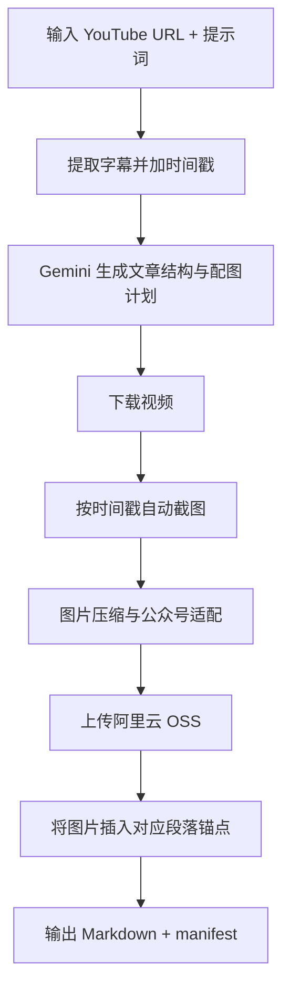

# 产品开发需求文档（PRD）

## 1. 文档信息

- 产品名称：YouTube 自动图文生产工具（Gemini + OSS）
- 版本：v1.0 MVP
- 更新时间：2026-02-17
- 目标用户：自媒体创作者、公众号运营者、WordPress 内容运营者

## 2. 背景与目标

### 2.1 背景
用户当前流程中，存在三个高频耗时动作：
1. 从 YouTube 视频中提取文案并改写成文章。
2. 手动找视频关键画面截图并压缩处理。
3. 手动把图片插入 Markdown 指定段落并上传图床。

### 2.2 目标
构建一套 10 分钟内可完成的自动化链路，实现：
- 输入 YouTube 链接 + 写作提示词。
- 自动生成可发布 Markdown 文章。
- 自动截图、压缩、上传 OSS 并回填图片链接。
- 输出直接可粘贴到公众号或 WordPress 的图文稿。

### 2.3 成功指标（MVP）
- 单次任务端到端处理时长 <= 10 分钟（15 分钟视频基准）。
- 自动配图命中率 >= 80%（人工主观评估可直接使用）。
- Markdown 可直接发布率 >= 90%（无需手动修复链接/格式）。

## 3. 用户故事

- 作为内容创作者，我希望粘贴一个 YouTube 链接后自动得到文章，省去人工整理字幕。
- 作为编辑，我希望系统自动选择配图位置并截图，避免我手工截帧。
- 作为运营，我希望图片自动上传到中国可访问图床，并生成可发布 Markdown。

## 4. 功能范围

## 4.1 In Scope（MVP）
1. YouTube 字幕提取（含时间戳）。
2. Gemini 文章规划与写作（含配图建议、时间戳、锚点）。
3. 视频下载与按时间戳截帧。
4. 图片压缩与公众号适配（WebP、宽度、大小控制）。
5. 阿里云 OSS 上传（RAM 子账号密钥）。
6. Markdown 自动插图并输出最终稿。
7. 生成 manifest 文件便于追踪与二次处理。

## 4.2 Out of Scope（后续版本）
- 自动发布到公众号后台。
- 自动发布到 WordPress 后台。
- 多平台图床切换（七牛、S3、Cloudflare R2）。
- 视频无字幕时自动 ASR 转写。

## 5. 关键流程

## 6. 详细需求

### FR-1 输入与任务创建
- 输入参数：`url`、`prompt`、`max_images`、`oss_prefix`、`oss_style`、`skip_upload`。
- 系统校验 URL 合法性并解析 `video_id`。

### FR-2 视频内容提取
- 使用 YouTube Transcript API 提取字幕。
- 输出带时间戳文本，格式：`[HH:MM:SS] 文本`。

### FR-3 文章生成（Gemini）
- 基于字幕 + 用户提示词，生成结构化 JSON：
  - `title`、`lead`、`sections[]`、`conclusion`、`tags[]`
  - 每个 section 包含 `image.need / timestamp / caption / alt / anchor`
- `anchor` 必须是正文中可匹配文本，用于插图定位。

### FR-4 截图与图片处理
- 根据 `timestamp` 自动从视频截帧。
- 图片处理规则：
  - 最大宽度 1080px
  - 单图目标 <= 2MB
  - 优先输出 WebP

### FR-5 OSS 上传
- 使用 RAM 子账号 AccessKey 上传对象。
- 生成公网 URL；若配置样式，拼接 `!wechat-style`。
- 严禁使用主账号 AccessKey。

### FR-6 文稿插图与输出
- 将图片插入 section 对应 anchor 附近。
- 输出文件：
  - 最终文章 `.md`
  - 任务映射 `.manifest.json`
  - 中间计划 `.json`

### FR-7 错误处理
- 无字幕：明确提示用户该视频不支持字幕。
- ffmpeg 缺失：提示安装命令。
- OSS 配置缺失：自动降级为本地文件 URL 模式。

### FR-8 安全与合规
- 密钥仅从 `.env` 加载，不硬编码。
- `.env` 必须加入 `.gitignore`。
- 不输出密钥到日志。

## 7. 非功能需求

- 可用性：CLI 单命令执行，默认目录输出。
- 可维护性：模块化拆分（视频、LLM、图床、主流程）。
- 可观测性：输出 manifest 记录每张图来源与链接。
- 性能：15 分钟视频处理不超过 10 分钟（正常网络下）。

## 8. 技术方案

- 语言：Python 3.10+
- LLM：Gemini（`google-generativeai`）
- 视频处理：`yt-dlp` + `ffmpeg`
- 字幕：`youtube-transcript-api`
- 图床：阿里云 OSS（`oss2`）
- 图片处理：Pillow

## 9. 配置项

- `GEMINI_API_KEY`
- `OSS_ACCESS_KEY_ID`
- `OSS_ACCESS_KEY_SECRET`
- `OSS_ENDPOINT`
- `OSS_BUCKET_NAME`
- `OSS_DOMAIN`
- `OSS_STYLE`（可选）

## 10. 验收标准（UAT）

1. 输入有效视频链接后，可生成结构完整的 Markdown 文章。
2. 文章内至少 1 张图片来自视频截图并插入指定段落。
3. 图片链接为可访问 HTTPS URL（启用 OSS 时）。
4. 输出中包含 manifest，能追踪 section 与截图时间戳。
5. 关键错误有可读提示，不出现崩溃式无信息退出。

## 11. 成本与风控建议

- 权限仅使用「公共读」，绝不使用「公共读写」。
- 建议开启防盗链白名单：`*.qq.com`、`*.weixin.qq.com`。
- 建议设置生命周期策略，定期清理历史图片。
- 建议使用 OSS 资源包控制超额成本。

## 12. 里程碑

- M1（当天）：CLI MVP 跑通（本地图片模式）
- M2（当天）：OSS 上传集成完成
- M3（+1 天）：配图命中优化与提示词模板沉淀
- M4（+3 天）：支持 WordPress 自动发布
